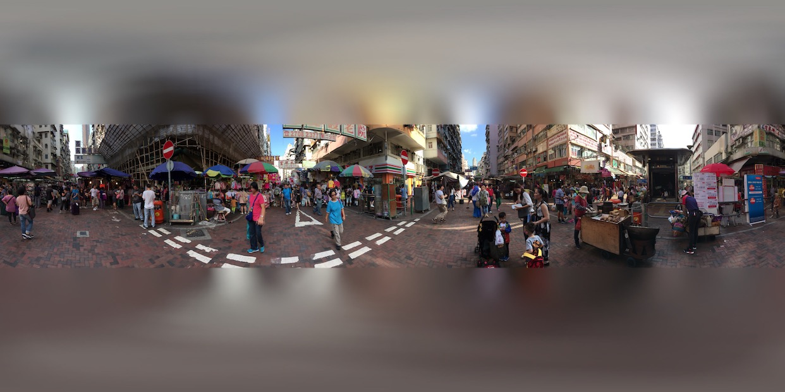
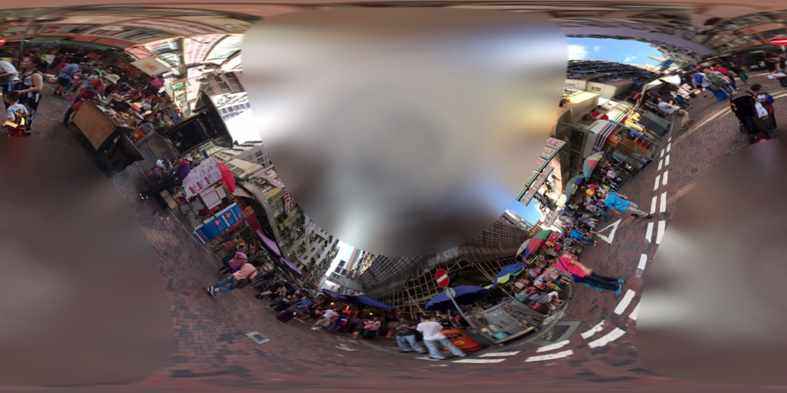

# equirectangular-image-rotation
objective-c template for rotating equirectangular image

#### Original image


#### After roll,yaw and pitch rotation


A spherical panorama that uses an equirectangular projection can be rotated by converting the uv's coodinate to spherical coordinate system and then 
to cartesian. The coordinates are appled by a 3x3 rotation matrix according to roll, yaw and pitch. Everything is then converted back to uv and 
sampled from the original texture.

Website reference:
https://en.wikipedia.org/wiki/Rotation_matrix

The method used
```  objc
-(UIImage*) applyRectRotation:(UIImage*) image
```

The class used
```  objc
customFilter.h
customFilter.m
```  


